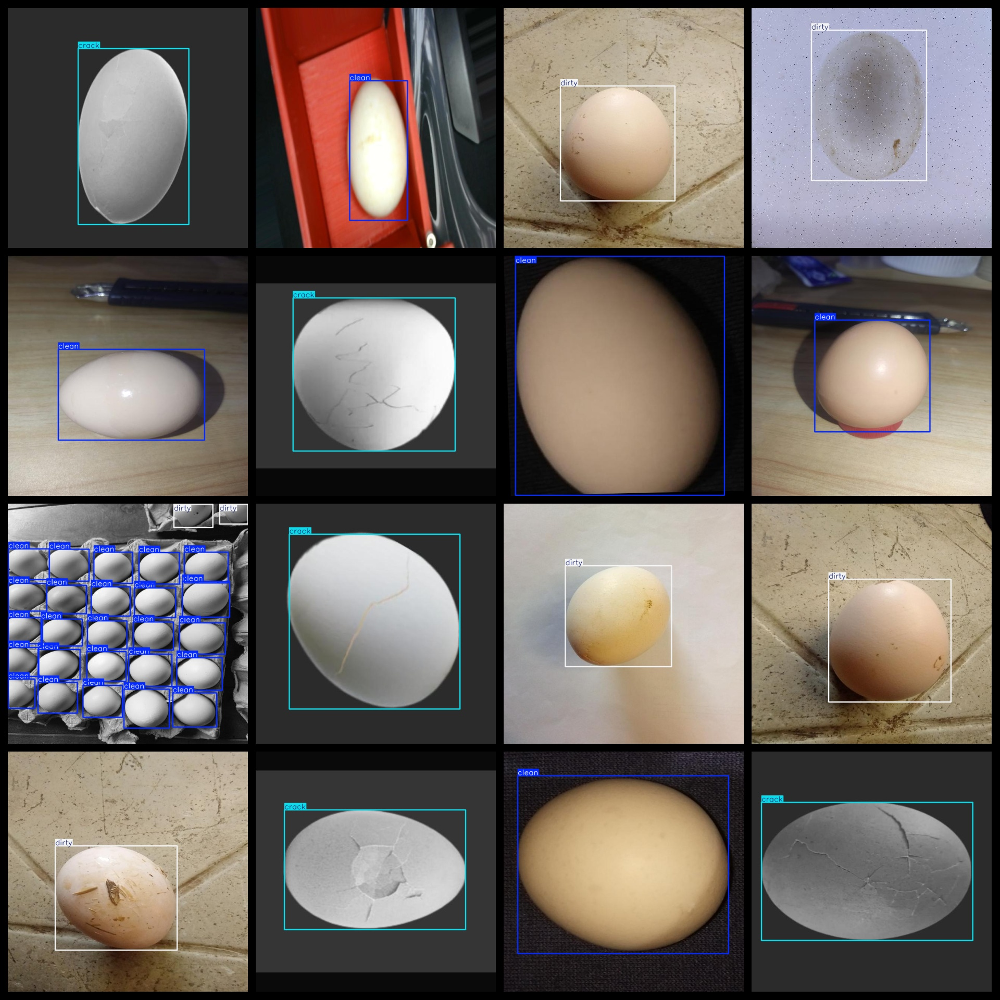
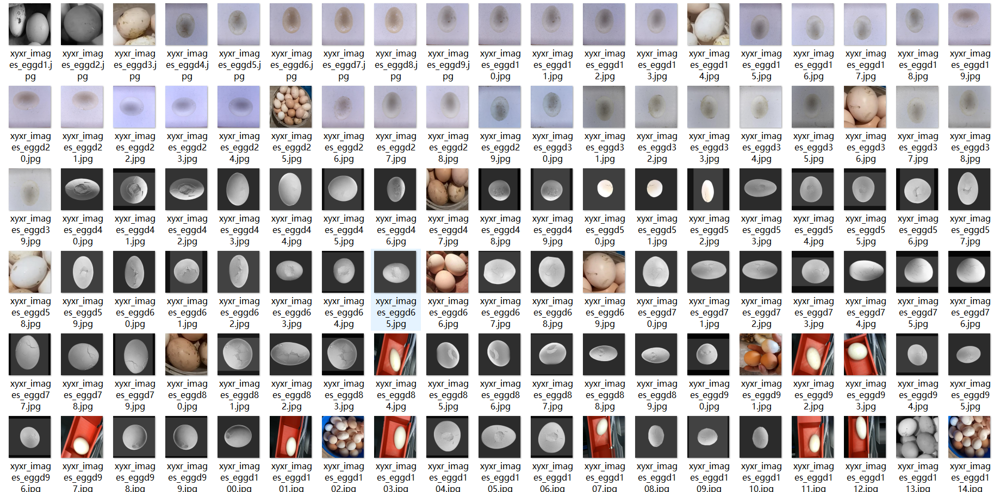
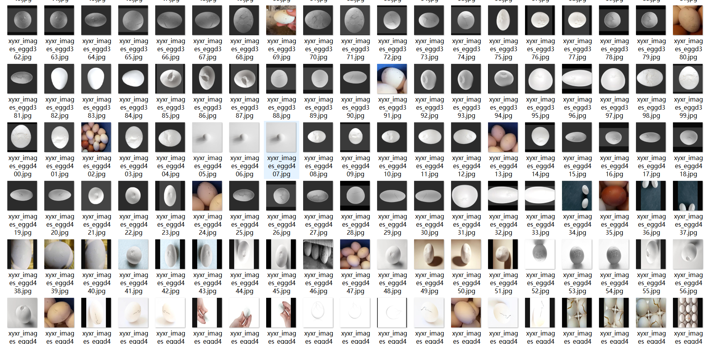

# [Object Detection] Egg Defect Dataset 3481 imagesYOLO+VOC format

【Object Detection】Egg Defect Dataset - 3481 Images in YOLO+VOC Format

Dataset Description: The image annotations are made for the complete egg, not for any dirty or cracked area of the egg, and the images have been enhanced.

Dataset Format: VOC format + YOLO format

The compressed file contains: three folders, each storing images, xml files, and text files.

Total jpg images in JPEGImages folder: 3481

Total number of XML files in the Annotations folder: 3481

The total number of txt files in the labels folder is 3481.

Number of tag types: 3

Tag names: ["clean","crack","dirty"]

The number of boxes for each label (Note that the order of labels in the Yolo format does not correspond to this, but is based on the classes.txt file in the labels folder):

clean frame count = 2608

crack frame count = 1560

dirty frame count = 1498

Total boxes: 5666

Picture clarity (Resolution: Pixels): Clear

Image Enhancement: Yes

Shape of the label: Rectangular box, used for object detection and recognition.

Important Note: None

Special Notice: This dataset does not guarantee the accuracy or precision of the trained models or weight files. The dataset only provides accurate and reasonable annotations.

## Images

---

Here is a pay link on Stripe (https://buy.stripe.com/3cs8yP7sY87d0vu9AB). Please contact me lonlonago@foxmail.com after funding $89, and I will send you a complete data files, thank you!

